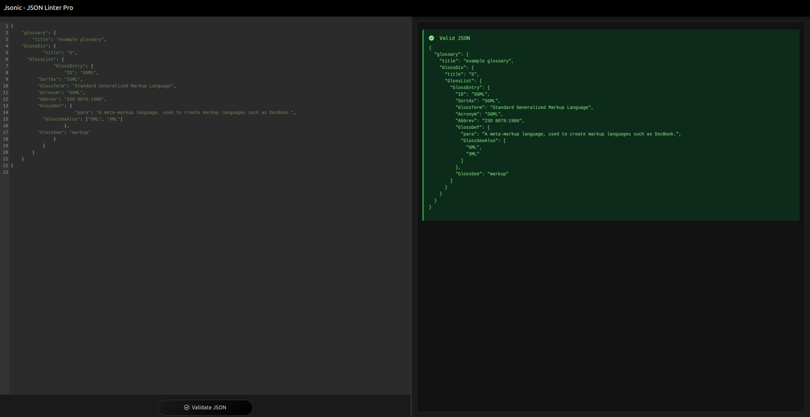

# Jsonic - JSON Linter Pro 🚀

A modern, feature-rich JSON validation and formatting tool built as a Progressive Web App (PWA). Validate, format, and debug JSON with ease!

👉 [Live Demo](https://simkeyur.github.io/Jsonic)

 <!-- Add a screenshot later -->

## Features ✨

- **Real-time JSON Validation**
  - Instant syntax checking
  - Detailed error messages with line numbers
  - Smart error suggestions
- **Code Editor**
  - Syntax highlighting
  - Line numbers
  - Dark/Light theme
  - Auto-close brackets
- **PWA Support**
  - Installable on any device
  - Offline functionality
  - Add to home screen
- **Enhanced UI**
  - Resizable panels
  - Modern Material Design
  - Responsive layout
- **Advanced Features**
  - JSON formatting
  - Error line highlighting
  - Keyboard shortcuts

## Tech Stack 💻

- **Frontend**
  - HTML5, CSS3, JavaScript
  - [CodeMirror](https://codemirror.net/) - Code editor component
  - [Bootstrap 5](https://getbootstrap.com/) - UI framework
  - [Bootstrap Icons](https://icons.getbootstrap.com/) - Icon set
- **PWA**
  - Service Worker
  - Web App Manifest
  - Cache API
